感谢W搭建blog的教程，第一篇文章就贡献给此次十一之行吧，聊记一篇流水。

之前少踏足江浙是因为想着以后反正要去江南长住，有的是时间游玩，便一直搁下行程。后来经历过一些事，便明白趁想去的时候便去，未来变数也太多，哪管得了那么远去。听小伙伴们说十一想去厦门，便也起了去江苏的念头，之后大家一合计，还是人多些有个照应，便定下来了组队去扬州和南京。节假日出行还是需要一些勇气的，无奈工作的工作，上学的上学，总没个大家都闲的时候，便也只好将就，避开头两日的人潮，定下三号到六号。看网上的攻略还有询问以前在当地待过的同学，做出个大概的行程，但由于决定的时候比较晚，还有不到两周便是假期，酒店房间比较难选择，基本不是满房就是离市中心较远，以后出行要更提前一些做计划才是，所幸九省通衢交通便利，车票倒是未成为难题。

大多数人对江浙的感情，应出自诗文历史。扬州又称广陵、维扬，“烟花三月下扬州”一句脍炙人口，春天的琼花自也吸引了不少人的目光。印象最深的是“二十四桥明月夜，玉人何处教吹箫”，为着它也就对瘦西湖念念不忘了。南京古称金陵，吴建都建业，后改称建邺，再后避司马邺讳改称建康， 东吴、东晋、南朝宋、齐、梁、陈皆定都于此，“南朝四百八十寺，多少楼台烟雨中”盖言佛教兴盛，也足见建康风茂。魏晋南北朝风流以外，又因《桃花扇》和《红楼梦》对此地颇多神思。

等待出行的日子总是漫长又漫长，还好每日有琅琊榜以充慰藉。

 
#### 第一天：东关街→瘦西湖→卢氏盐商古宅→古运河→东关古渡

睡了一晚上在晨光微熹中到达扬州，而后坐公交直奔住处---东关客栈。订房间的时候看了这家和另一家快捷酒店，觉得还是应该挑个有特色一些的，而且客栈又刚好在东关街上，想来游玩应该相当方便。

清晨,下公交后前往东关客栈

 
下公交的时候八点不到，路边给行人走的地方很宽，似乎是和电动车共用，反正不管走在哪儿，都可能有电动车从身两侧驶过，总能听到身后电动车鸣喇叭的声音，个人感觉有点小混乱，不是特别安全。在路边见一家“锦春鲜包”，当地的爷爷奶奶人手一个大塑料袋排好长的队，旁边的门店都已经坐满了人，还有很多人在等位，只好也跟着排队打包。在前面一个奶奶的指点下买了油糕、烧麦、蒸饺和鲜肉包（其实名字都是很好的，像千层油糕啊之类的，可惜我忘菜单了），虽然名字不见和其它地方有什么不同，但份量确实惊人，一般的笼屉放三个蒸饺，由此可见。其实后来几天几乎每顿饭都可见汤包/面/烧麦，倒是没正经吃过几次饭菜，不知是江南偏爱这些点心，还是为了满足各地游客的需要家常饭菜便少见了。

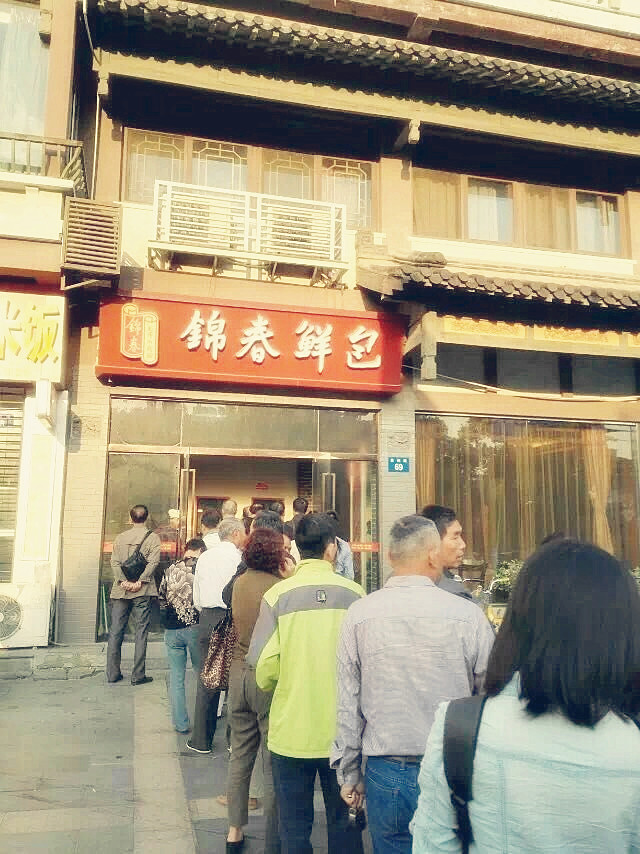

排长队的锦春鲜包

 
而后拐入东关街，由于时候尚早，此时很清静，零散几个行人拍着照，店铺也大多未开门，和晚上的灯火辉煌人潮如织完全是两个景象。找到东关客栈，是个很不走眼的小店，估计住的地方在后边隐蔽的院子里，但是门没开，隔着透明的玻璃门看店内也没人，打了一早上的电话没人接，在纳闷酒店不都是通宵营业的么，只好找了个小店先坐下来吃完早餐，趁人少拍了些照，随意往前走走看看有没有感兴趣的店等开门再来逛。差不多九点的时候折回来看客栈门还是没开，我上前试着推了推门，谁知门只是掩着压根没锁，哭，为我们的智商捉急。店内摆着一些洒坛，杨梅酒、桂花酒、黄酒等，前台没人，电话听筒另外搁在一边，往院子里走叫老板无人应答，这也太任性了，也不怕谁把店里的东西给搬走。回到前台等了会，一个中年大叔走回来，有点小呆，确定是老板，他说最好出去玩会儿十一点之后再入住。临走前拿了三瓶水，应该找零41的结果老板给了31，看数目不对和老板说，他又呆呆说不好意思补了十块。于是一致认为扬州是个很随性的地方。

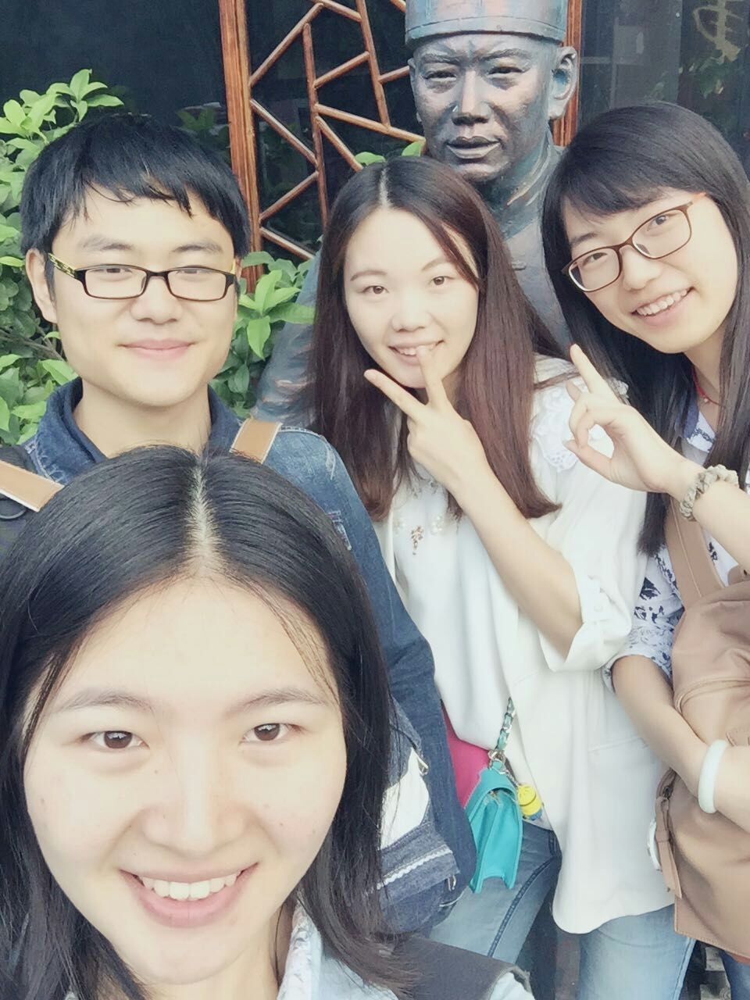

东关街入口，小伙伴的合照可以来一发

 
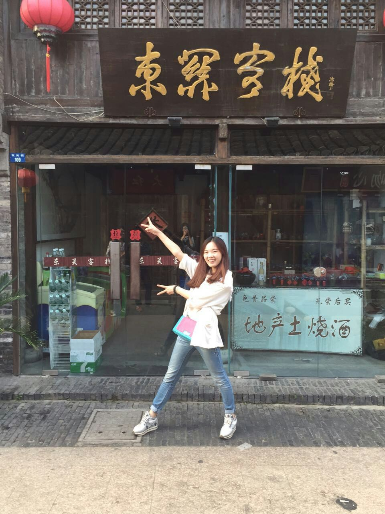

入住的东关客栈

 
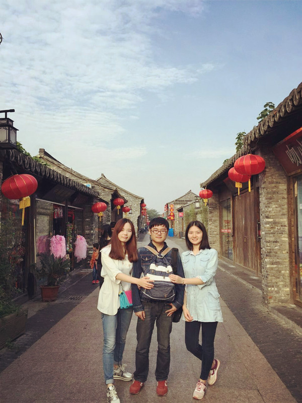

清早静谧的东关街

 
本打算第一天去何园还有个园，但看时间充裕便决定先去瘦西湖。有专门的旅游公交，连接各大景点，五元一张票可以一天重复坐，可去的时候不知道，坐的普通公交。到瘦西湖才觉出这是十一黄金周，自买票的地方开始便是游人成群。为买学生票纠结好久，因为事先以为借了学生证便可以，结果检票时候查很严，看照片不对还不让进，只好补了几张全票。怎么说呢，人实在是太多了，几乎就是跟着人潮走，看到人少的地方便停下来拍拍照，累了歇会，看周围的景致也并无太出彩的地方，大抵人气太盛遮掩了山水柳桥的灵气。觉得门票不值这个价，反正我是觉得还没颐和园好看，虽然当时并不知王国维自沉昆明湖，少了几分人文情愫，比不得二十四桥让人心往，但还是要吐槽一下，看到如此多的游人之后还保持着欢欣的心情也只为看看那座桥，本以为至少也得有辨识度吧，能让人在远处一眼便认出，可看了导游图确定就在这一带，明明都在远处看到了一角心里还想，不能是这座桥吧，走近后观察周围没有别的桥，老大不愿意希望是自己找错了，用手机在网上找出照片后对比才真正打消了残存的一点期望。即使在远处望着也是密密麻麻的人，为着千里迢迢的苦辛还是没忍住拉着小伙伴去凑了个热闹，也算是了却一点执念。之后便是随意看了看，江南园林初看觉得新奇灵秀，见多了也不免有审美疲劳，又不是自己实实在在地住进去，若当真能有这样一座宅子当真是极好了。对比起来，更喜欢西湖风光，自然也好人文也罢，都是更让人挂怀的。

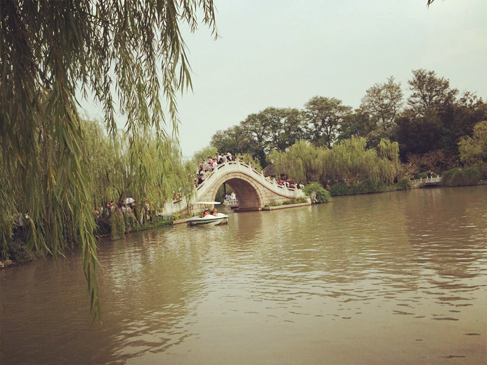

未于月夜相会的二十四桥

 
瘦西湖北边的出口便是大明寺，走了太久很累便未进去，坐公交回去，在东关街上的冶春茶社吃午饭，本来应该吃早茶，但临时就找了这么家有口碑的，人很多不过刚好等到最后一桌空位，开心。本地特色扬州炒饭肯定要点的，还有冶春蒸饺（冶春特色，个人没觉得比早上的好吃到哪儿去）、烫干丝、虾仁煨面、水晶肴肉（嗯，这些菜名是百度来的，以下同），南方的菜偏清淡偏甜，吃不出太多样的口味，但一应都是爽口的，于是也还喜欢。

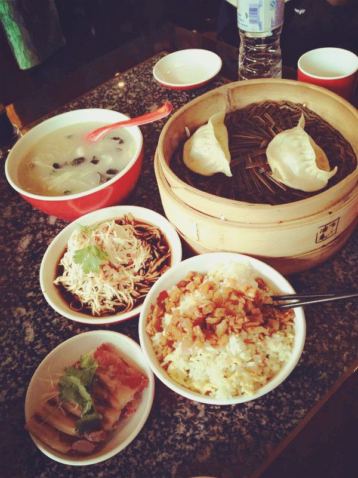

冶春茶社

 
随后去客栈入住，实际上住的地方不在店铺后面，而是街上另一条小巷子“雅官人巷”，比主街静谧很多，而且是一个独门小院，大堂装修得古朴，是旧式家宅的样子，正面和旁边都摆着太师椅，住的房间里挂着画，头顶的灯也雅致，果然选择是没错的。院子里种着小植物，旁边石桌上放着茶具，想若是自己能在江南小巷里有个小院子，老年来养养花，闲时出去逛逛，有水有桥的地方惬意得很。

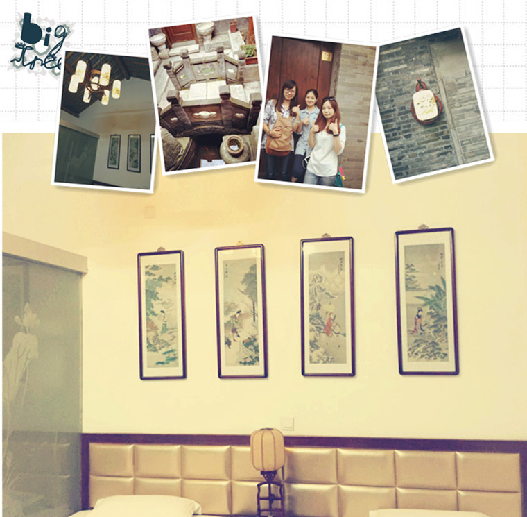

位于雅官人巷的小院

 
个园就在东关街上，看熙熙攘攘的人群便不想进去了，晚上应某吃货的强烈要求，去何园附近的卢氏盐商住宅用晚膳。卢氏古宅是扬州晚清盐商最大的私家住宅，真是几进几出的大院子，如今成了参观旅游以及专门用餐的地方，如果去吃饭的话便不需参观门票。包厢需提前预订，以“盐*厅”命名，大堂里的散桌便是当天当餐排队拿号，一般是每餐两轮每轮十多桌，晚上五点开始拿号，第一轮五点半出菜，我们五点多到的拿到第二轮第十号，如果再晚点便是“客官明儿请早了”。在门口等了会觉得坐着无聊，出去在古运河上的大屏幕看扬州2500年的宣扬视频，吹着风看不时驶过的舞乐画舫，到近七点半才排上号。也是进去了之后便觉得等这么许久完全值得。每进院子都很大，连接的长廊排着红灯笼，夜色下更有感觉，每进周围都是木质结构的两层，天井透光，装饰布景各不相同，我们吃饭的地方一进院子正对面便是好几竖长排垂落下来的大红灯笼，直叹不虚此行。可惜名菜八宝葫芦鸭需提前一天预订，地方菜马兰头也没有了，Q同学怨念不已，倒是一道蜜汁糯米藕惊艳不已，后来几天虽也在其它地方吃过这道，确都比不上，大家都说曾经沧海，应该先去其它地方尝尝的。还点了黄焖狮子头、文思豆腐（这个空间魔法卡片见过，当地特色，一直有印象）、 虾仁蒸蛋等，总体来说，菜的味道没有说比其它地方好上很多，就是做得精致，而且整个用餐环境氛围很不错，无怪乎这么多人去。要说富商就是会享受，这么大的宅子也不嫌空落，由此也见当时江南富庶景象了。

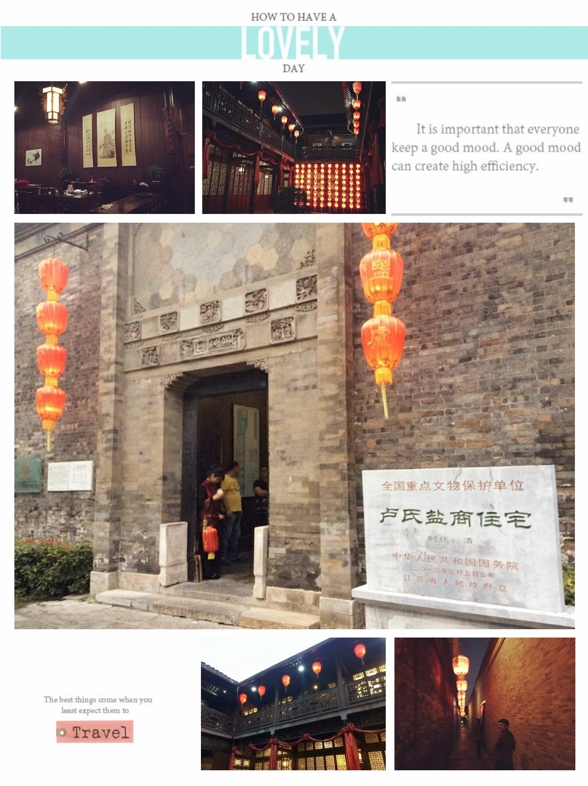

卢氏古宅

 
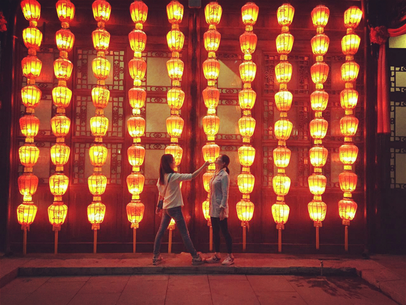

大红灯笼通明高挂

 
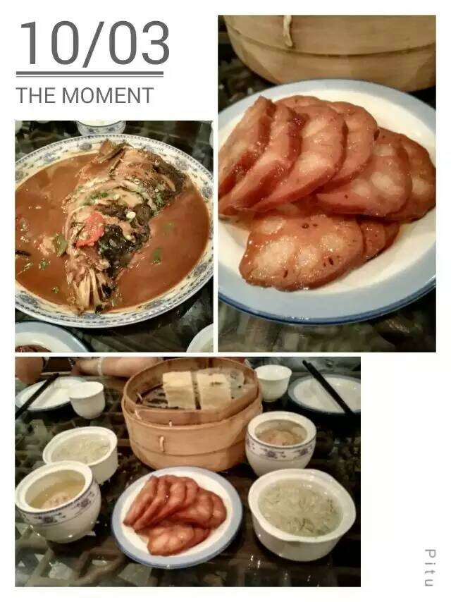

蜜汁糯米藕大赞

 
晚上沿着古运河散步回去，不是暖风也熏人醉，上午在瘦西湖见一个养鱼小瓷缸里有一个小盆，里里外外都是一元五角的硬币，本也想随着丢个硬币进去许愿，被Q制止，blahblah说了一堆游人素质的话（倒），于是晚上便又拿了一个硬币，想丢这么大的河里怎么也不碍事吧，许下几个人五年内再来扬州去卢氏古宅盐奢厅包房吃饭的愿望，几人说说笑笑便回去了，希望能如愿，某人记得要抱酒（缘由是我们晚上在等叫号时，那些定包房的人一看就神气得很，几个人傲慢地走进去，也不管服务员的劝阻，后面定有一个人或提或抱着一瓶一看就高大上的酒。于是坐等姐夫请客）。东关街入口对面便是东关古渡，早上走到这里居然未曾留意，此时回去东关街上便是人声嘈杂，再无早上安静时的姣好了。

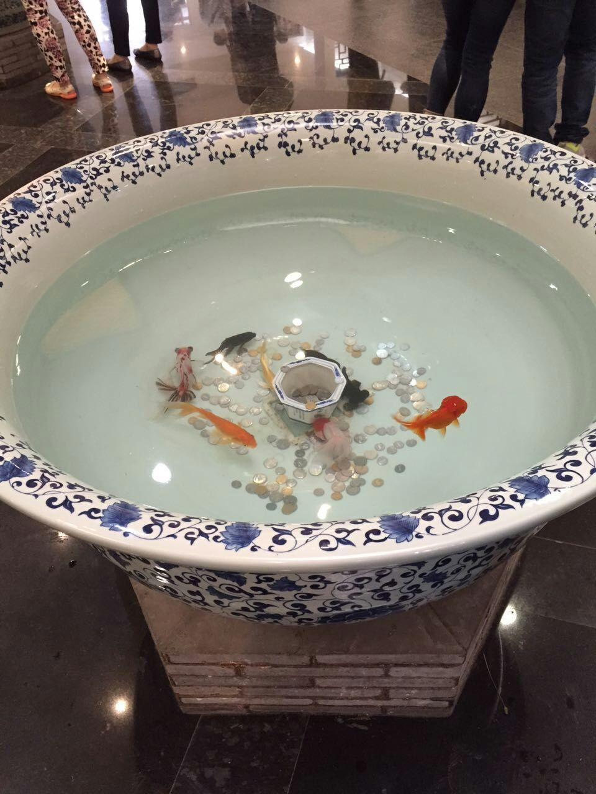

祈愿金鱼缸

 
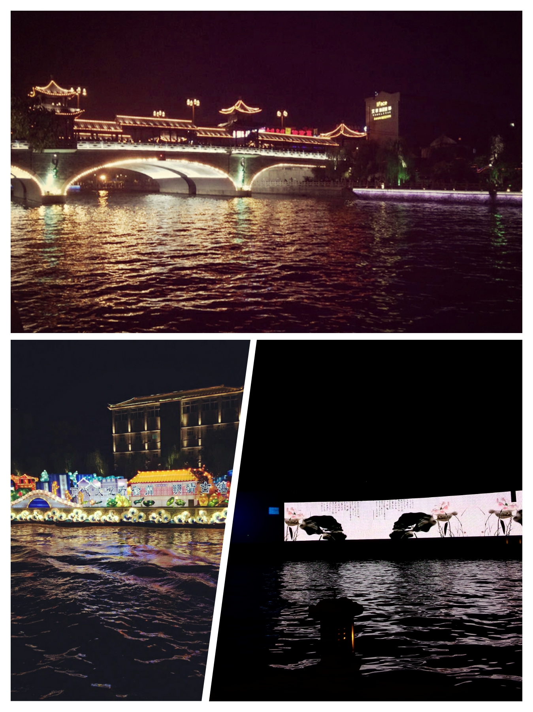

古运河夜景

 
#### 第二天：琼花观→朱自清故居→中国剪纸博物馆→→南京秦淮河

在东关街上吃过早餐（阳春面大赞，糯米藕还是不如前晚的），兵分两路，Q对郊外的隋炀帝陵神往已久，我们便在附近的小巷里看看。知道扬州琼花是因为《宫心计》，结局三好在一株琼花树下回头，便又遇见了失忆的江显扬（话说一直觉得这个名字不错），算是大团圆吧，便对琼花寄予了如男女主之间坚定感情的厚望，只是未在阳春三月，便也只见树而不遇花了。想起前一阵入学九月，饭后散步到樱花大道，听迎面而来两个男生在讨论，这樱花到底在哪儿吖。笑，相见不识。想来各地的风景，也因着四时变化而各有风姿，只有真正在一处住上几年，才能领略，旅游也无非是浅尝辄止罢了。

朱自清故居差不多和琼花观隔街对望，得往小巷子里走一会，周围是普通的民居小院，但由于后来的重新装潢，一眼就可认出这家与别家的不同。虽然父亲未到月台送过我，可父母关爱儿女的心思总是一样，每个人最割舍不下的也是亲情。里面保留着当时的物件陈列，于是想着一家人，住在这样的一个不大的院落里，生活应当是很和谐的。

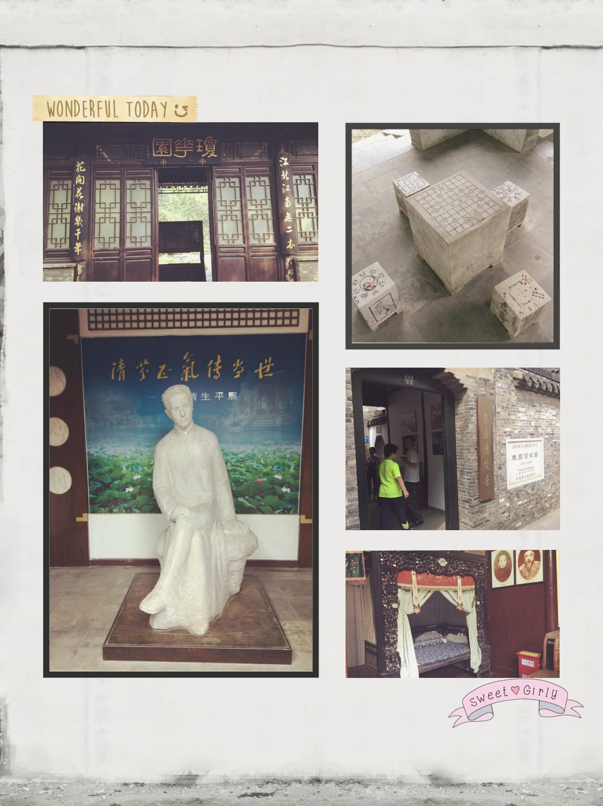

琼花观并朱自清故居

 
中午匆匆赶回去，写过明信片（时间太赶，字迹潦草，收到勿怪），便踏上了前往金粉六朝旧都的旅途。车票是当天临时买的，加开的车，第一次坐硬卧代硬座，一下车便觉出省会的人流不同于一般城市了。但车站人再多，公交也比不得大武汉拥挤，真是在这个地方生活过便会觉得任何一个城市宜居。订了夫子庙附近的如家，主要考虑交通便利又临主要景点，整顿过后休息一会，和同来南京游玩的HG一起吃了晚饭。商业街上行人拥挤，尤其是夜晚的夫子庙和秦淮河，远远望见排队等游船的人绕了好几个圈，心下计较此次怕是坐不成了。远离主街找了个店，和扬州口味差不离，多了特色的鸭血粉丝汤，然而，委婉的说，未见出奇。也有糯米藕阳春面蟹黄汤包这些，但都比不得扬州。江南口味偏甜糯，好精致点心，所幸我平常就不吃辣喜甜，所以这几日也还过得习惯，同行的小伙伴却都直呼想念湖南的辣椒，想来北方人是更不习惯的了。饭后走了走，在河边一处人少的地方歇着，可以看见画舫载着满满的人来来回回，拖着长长的水波渐远，船上还有负责解说以及倒茶的服务员。头顶不时有蝙蝠低飞，吹着风也清快。朱自清与俞平伯曾坐船同游秦淮，各成一篇《浆声灯影里的秦淮河》，此次虽未得画舫游乐，但他乡故知，秦淮河畔笑谈近况，是难得之事。

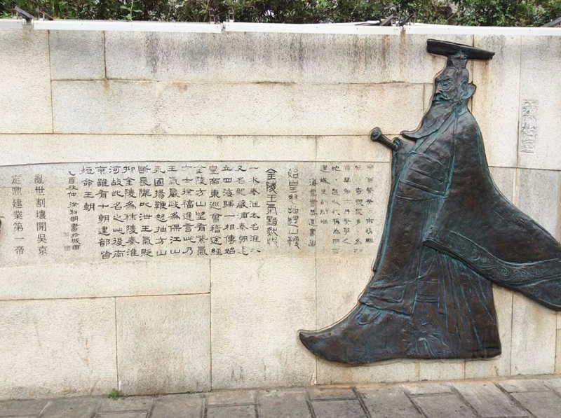

秦淮河畔石刻，小字可以一看，可惜图上不是很清楚

 
#### 第三天：总统府→先锋书店→南京大学→玄武湖→夫子庙

早上路过看了夫子庙一眼，然而八点半才开放，就先去总统府了。去景点的话推荐网上先订好票，需提前一天预约，到时便可直接领票进去省下不少时间。走到总统府前见人排满大半条街，穿过人群取了票进门，回头看着排到队尾的人才明白，撇下排队的人畅行无阻此种感受非亲身经历不可体会。可惜虽然出门早，还是遇见了人山人海，同样跟着人流走，大致浏览了下太平天国以及中华民国时期的历史沿革，无奈人多复人多，也是无法。

夫子庙，亦在秦淮河畔

 
然后步行去先锋书店，沿着广州路走，经过南京大学，想着等会回头再拜访。先锋书店号称是全国最美的书店，之前在南京念书的同学推荐，去南京玩过的同学也推荐，店面不起眼，类似地下，进去之后却别有洞天。最外面摆放着明信片，门口有桌子供书写并贴邮票，往二楼去的一条长道整齐排列着书，先前并未注意，回头看路尽头墙上挂着十字，二楼除了书外还有创意文具，以及小小的咖啡屋。似图书馆摆放了很多桌子供阅读书籍，正是书店该有的样子。明信片很有质感，买了一些自己收藏，挑几张写给朋友，这次倒是坐下来细细写的，希望收到的人喜欢。

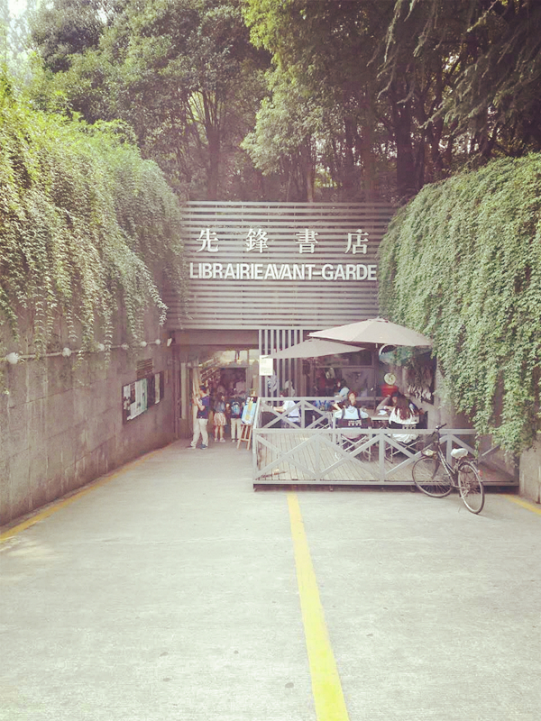

南京大学鼓楼校区外的先锋书店

 
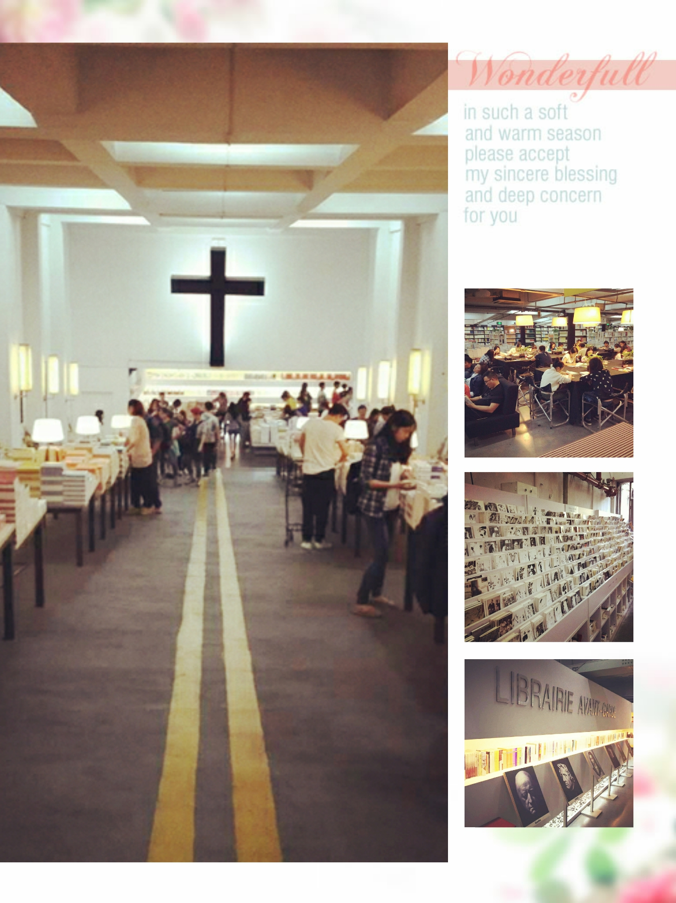

天堂应该是图书馆的模样

 
而后掉头去南京大学，感觉也是南方大学的样子，和中山大学类似，保留了早时的建筑，不见多高大，显得秀气小巧，沿着中轴线穿行，倒是不一会儿就出去了。见过的大学中，还是最喜欢母校，四时景致皆可观，春天樱花自不用说，秋天金桂飘香，银杏粲烂，夏天高大的梧桐遮荫，冬天雪景可人，留存下来的建筑也颇有特色，再加上历史悠久，让人不得不爱。在这生活了五年，有着怎么也舍不下的情感，以后大抵也是无法替代的所在罢。

去湖南路吃午饭，能说走到那儿已经三点多了么。不过还好不是饭点，到推荐的连锁南京大排档还没有满客，好像稍微再过会儿就开始排号了，不愧是好评多的店。虽然金陵盐水鸭售罄，但美龄粥、金牌煎饼、天王烤鸭包都让人满意，王府泡椒鸡酸酸甜甜的，有点不太合口味，店内装修有特色，服务生也统一穿着，吃着很有气氛。

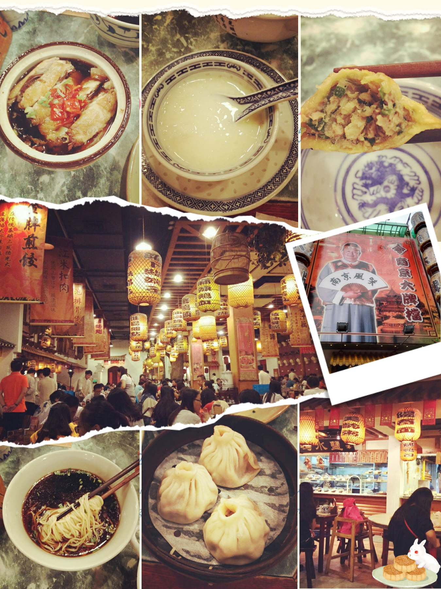

南京大排档

 
逛着散步到玄武湖旁边，抬眼便见昨日下车的南京站，如此看来倒是水面开阔，别有一番境界。湖边冷风吹，有点小凉快，几个人沿着小路走，说些家常，也是很开心的事，从来有水的地方就温柔，东湖也是如此光景，可惜倒没正经和人沿着东湖散过步。算起来从早上八点多出门，到晚上差不多真是结结实实走了半天的路，还好看了风景也不能算太累。

回去路上经过夫子庙，人比早上多很多，太过喧哗本不打算进去，可想着怎么也是标志性景点，而且应当拜拜孔圣人，便买了票。正中有孔子雕像，沿路两旁是几位知名弟子，大殿里悬挂着孔子的巨幅画像，为弟弟记名挂了块祈福牌，希望明年考试顺利。再往后便是介绍历朝科举制度的变迁兴衰，印象最深的便是一双写满密密麻麻小字的袜子，应该是士子科考时作弊的小抄，想来这个习惯历朝皆有由来已久，古今皆同啊。

 
#### 第四天：南京大屠杀纪念馆→南京博物院

今天的行程是最不可错过的。自1937年12月13日起，南京大屠杀30万余同胞尽遭杀戮，每一个国人都不该忘记。纪念馆外都是还原当时情景的雕塑，虽未切身体验，看了却也惊心，主体建筑外只挂着300000这几个醒目的数字，分外刺眼。虽然依旧是人潮，但在昏暗的展厅里看那些随着时间的推移发生的各种惨案，心下总是无名悲痛，解说特意用了中英日三语，也有些警醒的意味。历史沉痛，但有句话说的对，我们该记住的是历史，而不是仇恨。还原真相，理智对待。

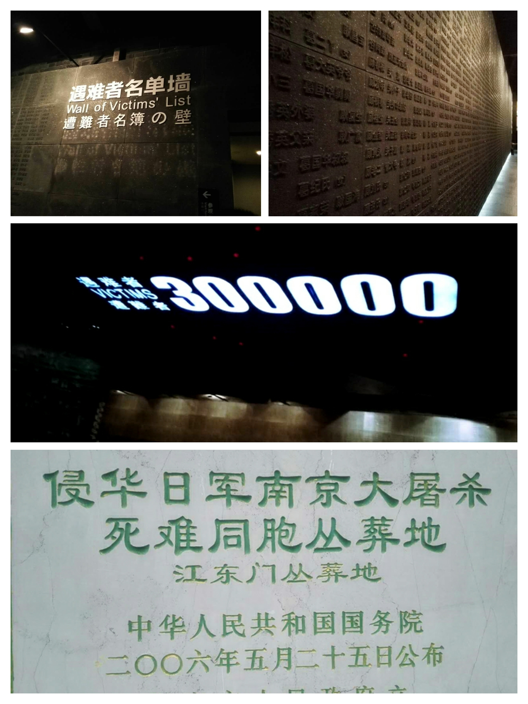

南京大屠杀纪念馆

 
中午赶回去退了房，提着大包小包出发去南京博物院，好像每到一个地方都要去看看当地博物馆的，历史见证了一个城市的印迹，也是最令人向往的所在。南京博物院是中国三大博物馆之一，进去之后跟着义务解说员听了一路，看到一件镇馆之宝银缕玉衣，旁边还有一套金缕玉衣，但为何镇馆之宝不是金的反而是银的呢，因为金的玉片多佚，人工修补部分较多（好吧其实我肉眼是看不出差别的）。到宋元时由于怕赶不上六点的车便自己看了下，其实去博物馆确实应该找个懂行的人解说，一个人逛也只能看看藏品不懂其中的典故原委。看完后有点小失望，号称中国第二大博物馆，但没特别的展品，整体修建也不是很大气恢宏，要我说还没湖北省博好，至少有个曾侯乙编钟，湖南省博马王堆汉墓出土的辛追夫人都更有看头。说起来，湖南省博12年开始重修，估计16年才能重开，作为当地人都没去看过真是惭愧。

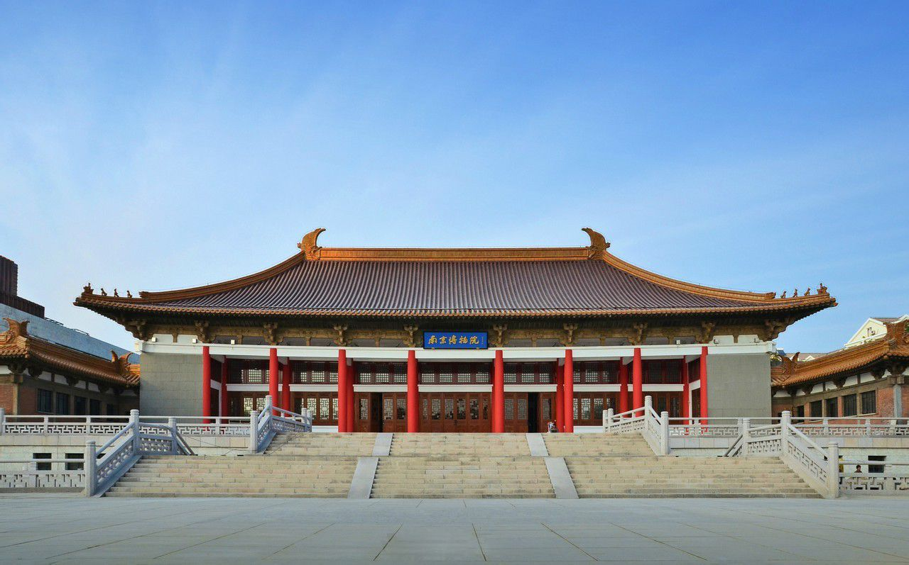

南京博物院（图片来自互联网）

 
晚上回到武汉，至此四天的行程算是结束了。扬州给人的感觉很好，虽然作为旅游城市得到开发，但并不市侩，当地的人热心随性，城不大风景却好，是个适合养老的地方。可惜不知是不是天气问题，在扬州并未见月色，“天下三分明月夜，二分无赖是扬州”，不过留有遗憾也是好的，下次定当仲春三月再访佳地，琼花月色皆不负。金陵的话，到底是省会城市，商业化气息太浓，人多车杂，又抑或去之前内心期望值太高，魏晋风流与秦淮佳人遗韵，被太多的游人冲淡，也是应该挑个平常日子，拜鸡鸣栖霞走中山陵，坐画船夜游秦淮，以后有缘定当再会。