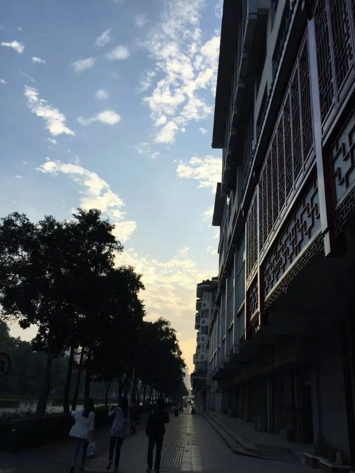

感谢W搭建blog的教程，第一篇文章就贡献给此次十一之行吧，聊记一篇流水。

之前少踏足江浙是因为想着以后反正要去江南长住，有的是时间游玩，便一直搁下行程。后来经历过一些事，便明白趁想去的时候便去，未来变数也太多，哪管得了那么远去。听小伙伴们说十一想去厦门，便也起了去江苏的念头，之后大家一合计，还是人多些有个照应，便定下来了组队去扬州和南京。节假日出行还是需要一些勇气的，无奈工作的工作，上学的上学，总没个大家都闲的时候，便也只好将就，避开头两日的人潮，定下三号到六号。看网上的攻略还有询问以前在当地待过的同学，做出个大概的行程，但由于决定的时候比较晚，还有不到两周便是假期，酒店房间比较难选择，基本不是满房就是离市中心较远，以后出行要更提前一些做计划才是，所幸九省通衢交通便利，车票倒是未成为难题。
大多数人对江浙的感情，应出自诗文历史。扬州又称广陵、维扬，“烟花三月下扬州”一句脍炙人口，春天的琼花自也吸引了不少人的目光。印象最深的是“二十四桥明月夜，玉人何处教吹箫”，为着它也就对瘦西湖念念不忘了。南京古称金陵，吴建都建业，后改称建邺，再后避司马邺讳改称建康， 东吴、东晋、南朝宋、齐、梁、陈皆定都于此，“南朝四百八十寺，多少楼台烟雨中”盖言佛教兴盛，也足见建康风茂。魏晋南北朝风流以外，又因《桃花扇》和《红楼梦》对此地颇多神思。
等待出行的日子总是漫长又漫长，还好每日有琅琊榜以充慰藉。

#### 第一天：东关街→瘦西湖→卢氏盐商古宅→古运河→东关古渡

睡了一晚上在晨光微熹中到达扬州，而后坐公交直奔住处---东关客栈。订房间的时候看了这家和另一家快捷酒店，觉得还是应该挑个有特色一些的，而且客栈又刚好在东关街上，想来游玩应该相当方便。

清晨,下公交后前往东关客栈

## 2. 解题思路

- 确定删除函数的参数，因为头节点也可能被删除，因此函数申明应该用指针的指针；
- 如果当前结点的值和下一个结点的值相同，那么它们就是重复结点，需要删除；
- 把当前结点的前一个结点和后面值比当前结点要大的结点相连；

## 3. 参考代码


struct ListNode {
	int m_nValue;
	ListNode* m_pNext;
}

void deleteDuplication(ListNode** pHead) {
	if(pHead == NULL || *pHead == NULL)
		return;

	ListNode* pPreNode = NULL;
	ListNode* pNode = *pHead;
	while(pNode != NULL) {
		ListNode* pNext = pNode->m_pNext;
		bool needDelete = false;
		if(pNext != NULL && pNext->m_nValue == pNode->m_nValue)
			needDelete = true;

		if(!needDelete) {
			pPreNode = pNode;
			pNode = pNode->m_pNext;
		} else {
			int value = pNode->m_nValue;
			ListNode* pToBeDel = pNode;
			while(pToBeDel != NULL && pToBeDel->m_nValue == value) {
				pNext = pToBeDel->m_pNext;

				delete pToBeDel;
				pToBeDel = NULL;

				pToBeDel = pNext;
			}

			if(pPreNode == NULL)
				*pHead = pNext;
			else 
				pPreNode->m_pNext = pNext;
			pNode = pNext;
		}
	}
}


## 4. 思考

- 由于头节点可能会被删除，因此需要指针的指针，也就是所指向头节点的指针的值可能会改变，但是指向头节点指针的指针的值则不会改变，画个图就能很清晰地看出来；
- 注意其中的逻辑处理，以及代码实现；

## 5. 参考

- [《剑指offer》](http://www.broadview.com.cn/#book/bookdetail/bookDetailAll.jsp?book_id=12c9bc27-a944-11e4-9c0a-005056c00008&isbn=978-7-121-23245-9)