从新加坡回来一周多，写篇纪行罢。

新加坡别名“狮城”，于1965年独立，之前的印象只在于“亚洲四小龙”以及“花园城市”的美誉。高中物理老师提起过这个地方，作为正面教材来对比我们城市街道的脏乱差程度，当时也就左耳过右耳出，不想几年后会站在那片土地上切身体会名不虚传的绿化环境。
开始打算这次出游差不多是小半年前，因为老乡Y过去念书之后工作了，觉得关系还不错可以投奔，再加上室友H去那边交流一年，有相熟的人之后感觉那个地方也不再那么陌生。对自己来说，出游目的地的选择似乎和当地风光没有太大关系，要么因着历史兴衰过往，要么因着有些玩得来的朋友，其实都是这样，对和自己没有特殊感情联系的事物，即使再美好似乎都提不起兴趣。本来上个学期就想去，因为种种原因计划搁置，这学期开学事少便预备翘几天班出发。

 
## 准备篇
第一次出国旅行，试着查一些攻略，看上去大多吓人，要准备很多东西注意很多事情什么的，自己实际操作一下就知道其实还好。反正旅行最需要的是心情，其次是时间，有点小钱更好，没有也没太所谓（汗，说是这么说，自己出去玩肯定要攒一段时间钱的，正如Boss说的好，穷家富路。有些地方可能一辈子就去一次，有些路有些风景也都仅此一次，吃好玩好比较重要）。

签证找旅行机构代办，不同代理点要交的材料不一样，不过护照和整本户口簿的复印件一定要，工作的要工作证明，还在上学的要学生证复印件和自己或家长的存款证明。自己是出行前两周的样子拿护照和冻结三个月的一万存款证明找国旅办的，说是5~7个工作日，也差不多一周不到的样子可以拿到，有效期一个月。签证好了之后再订的机票，提前几个月订价格会低很多，不过因为之前没有计划具体出行时间，也不知道签证能不能弄好，就还是临时看的机票。看攻略说去新加坡占花销比较大的是机票和住宿，住宿多亏室友帮忙，机票还是要自己动手。虽然新币对人民币差不多4.8：1的汇率，但食物一般一顿差不多就5~10新，预算不多还是可以接受。

看机票也花了一些时间，转机一般走深圳广州厦门，凌晨到然后上午九十点再出发，肯定是无法接受的。武汉直飞随时间不同价格差异也大，因为周一要开会不能翘，来回路上花费两天，计划玩三天，所以只能周二到周六或者周三到周日，私心更想少翘一天班，看近三周的价格心也挺累，想着以后要是银子多就好，哪用得着这么精打细算，想去哪就去哪。回過頭想想准备工作也是旅行的一部分，正如生活中一件件琐屑小事，为之心烦也好偷乐也好，好好处理之后才能看到其溫潤绵长的本质。最后直接在新加坡航空官网定的圣安航空，注册了一个krisflyer会员，选好座位定好飞机餐便大功告成，小声说人家官网还支持支付宝付款。最后去银行换了一些新币，查天气预备带哪些衣服，出发前几天买好美亚保险，这个倒是必不可少，虽然多半不用，也最好是用不着，但不怕一万就怕万一，准备工作充分一点好。
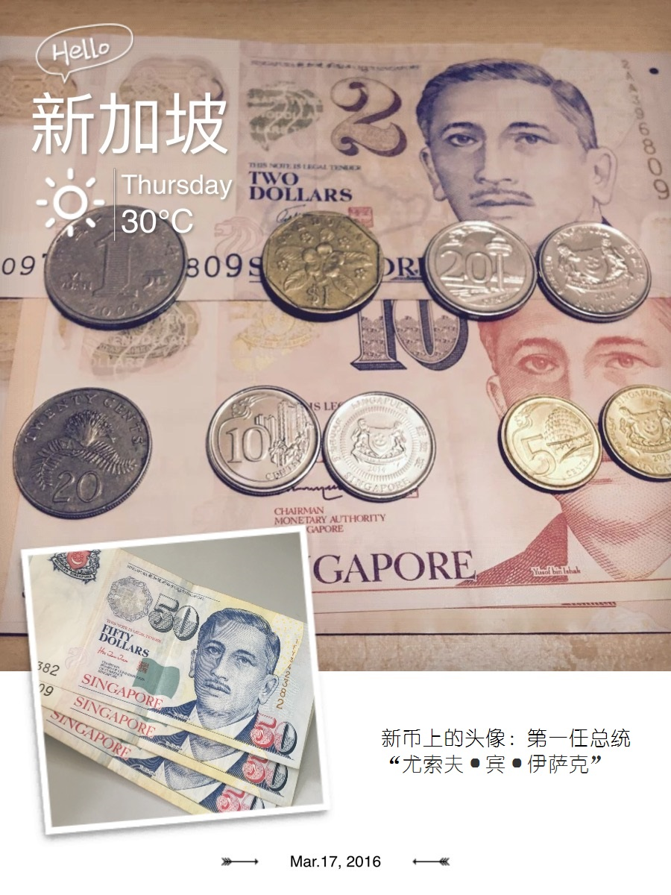

不同面值的新币

 
过去的飞机下午三点到八点，机智地定了低卡路里餐，配有粗粮饼干和水果，啤酒橙汁可乐咖啡什么的都有，都不感冒只要了白水。室友先前说空姐很漂亮，个人不觉得，东南亚人有点黑，妆化很浓倒是很热情，一水天蓝的制服欣赏不了，吐槽一下英文不标准中文不大会。不过见到的唯一一个空少还不错，高个帅气至少中文有点流利。飞机上找空乘要张入境卡，不会填可以问，我前排的就直接把护照什么的给空乘让他们给写了，空乘会问具体情况然后帮忙填好，服务态度都让人满意。

低卡路里餐

 
第一次坐飞机选了临窗的座位，起先看着景色变化还兴致勃勃，拍了好几张照片，后来一直是蓝天白云与机翼的视野实在难让人长情，便安心休息起来。近七点半天才黑，快降落的时候看到海面上灯火辉煌，远方的城市也璀璨亮眼，感慨自己大抵还是喜欢繁华富庶气象多一些，梅妻鹤子挺向往，也止于向往，长久不了。
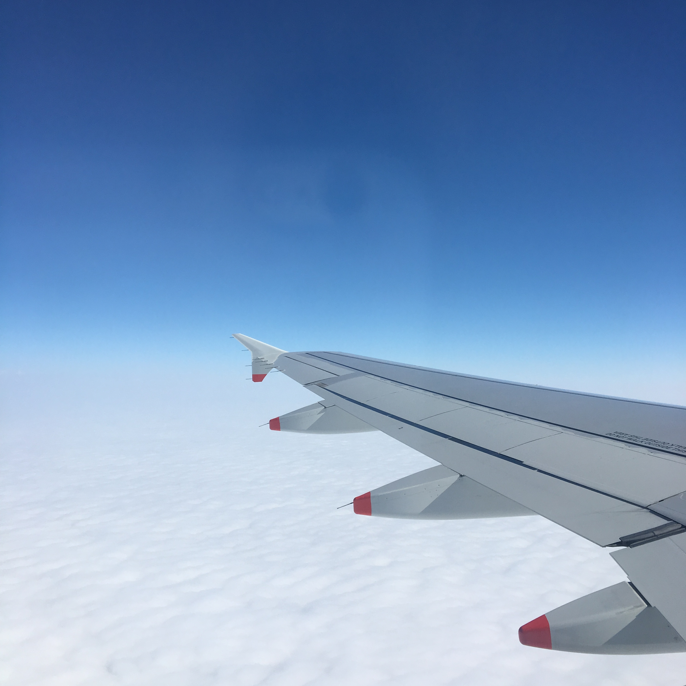

厚重云层之上

 
下飞机之后觉得有点小热，武汉最高二十的温度似乎还没那儿最低温度高，由于地处热带，平均温度三十加，昼夜温差小，又多雨，正午走在阳光下有点小灼热感，但没有武汉夏天热，总之还算适合出游。樟宜机场获赞誉无数，也的确是环境优美宽敞舒适，比较起来武汉要从国内航站楼步行一段距离才能到达的国际航站楼可称得上是又小又破，里面各种免税店是极佳消磨侯机时间的去处。

晚上八点多抵达樟宜机场

 
办完入境手续后和Y汇合去坐地铁，晚上地铁没武汉挤，而且线路就那么几条不同颜色，肯定比北京好很多。Y说新加坡可能和武昌差不多大小，看地图也确实不大。查了下国土面积700多平方公里，武汉8000多，武昌区80多，从数值上看差距还是有，可能包括了海域之类吧，不过繁华地段是差不多武昌这边大小。中途换了两次线，绿线转黄线再转紫线，没什么人，离地铁门近的都是reserved seat，颜色比旁边的座深，反正那几天就算站着也没去坐。两人聊着聊着感觉一会就到了，要走的时候自己坐去机场才发现其实差不多有一个小时，感谢赞助的公交卡和sim，方便太多。还有一个觉得很神奇的地方，新加坡每栋房子都有自己的邮编，打车只要和司机说邮编就可以直接到，侧面又说明那里地方并不大了，到H的住处之后收拾下，然后讨论定了大概去哪些地方，就记得两人聊到好晚，迷迷糊糊睡过去。
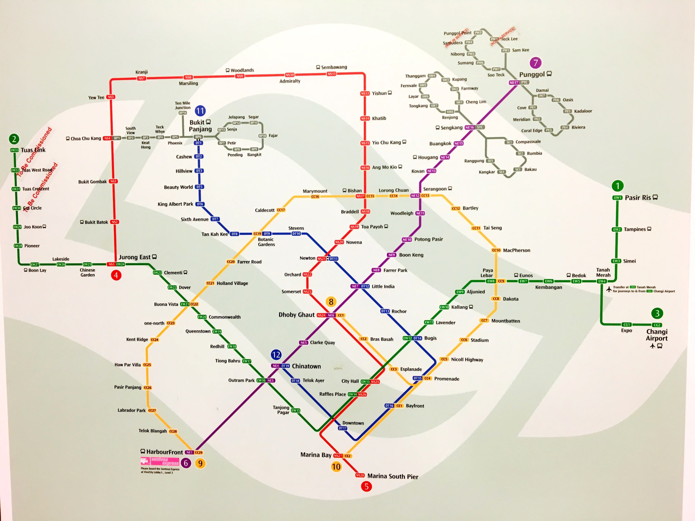

地铁线路图

 
总共三天去玩的地方没太多，新加坡也不是个历史多悠久有很深文化积淀的地方，当地大部分是华人，还有马来西亚、印度等地方的，街上望过去一半都是背包拿相机的游客，没有特色便是当地特色了吧。大部分人会说中文，随处都可见中文，一般交流没问题。人们很有礼貌，最常听的就是excuse me和thank you，尤其是工作人员很热情，便利店收银员会对每个顾客说thank you，景点工作人员会非常主动询问是否需要帮助，不过当地人说英语有点口音，新加坡本土化的感觉，有时候不怎么好听懂。有去博物馆美术馆看人文艺术，也去圣淘沙滨海湾领略自然风光，食物的话融合了各个国家特色，西式、印度、马来西亚、日本、韩国还有中国，东西基本靠进口，去一趟可以体会很多不同国家特色，海鲜和热带水果相对诱人，过去的人说吃来吃去还是中餐美味，深以为然。

 
## 人文篇
#### National Museum of Singapore

新加坡国家博物馆是第一站，离室友所在的SMU很近，差不多城市中心位置，想说SMU也是财大气粗，各个不同的院系分散在城市繁华区域，没有校门，不像南洋理工在很靠西边的地方，从机场过去几乎要横穿整个新加坡。

位于Stamford Road上的SMU LABS

 
博物馆啊美术馆啊这些只对当地人和PR免费，持学生证半价，不愧是旅游国家，也是创收的一种方式，买票后统一发放小条贴在左胸前，便算是游览凭证。吃完早餐后自己去逛了，博物馆外面看上去很大，白色建筑，绿化做得很好，几乎每天都阳光明媚，天蓝得不真实。
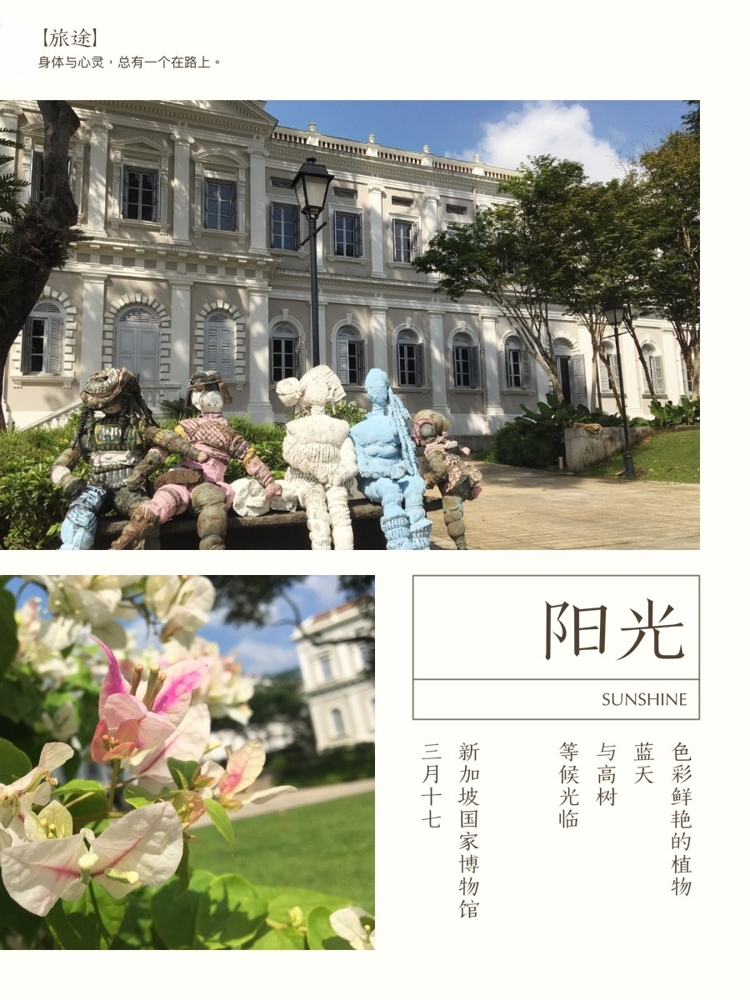

阳光明媚

 
里面三层，欧式建筑风格，穹顶喜欢。

博物馆的穹顶

 
主体是一楼讲述新加坡历史，可以慢慢看；二楼是当代变化发展这些，可看的比较少，但是建筑很有特色，遇到两对拍婚纱照的新人，倒是和武大一样；负一楼是英国特别展，赶时间便没去看。
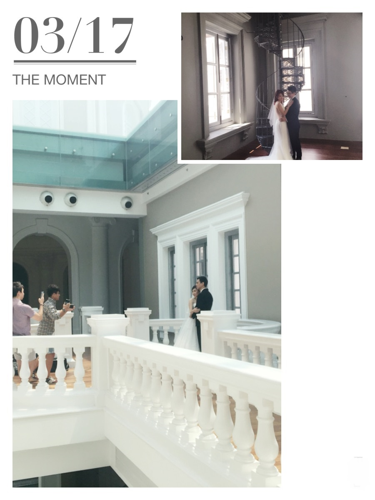

两对新人

 
里面的空间很大，透过玻璃看外面白色建筑映衬着蓝天白云赏心悦目。不过整体感觉可看的没省博多，个人更偏好国内的博物馆。
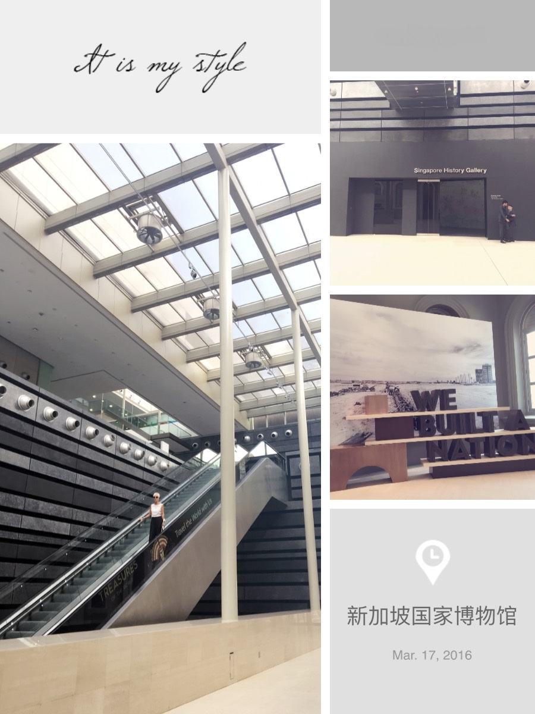

博物馆内部

 
一楼讲述新加坡历史的展馆进门处有一幅电子投影地图，偏好这种中世纪的绘制风格。上面新加坡的标注是马来语“Singapura”，小红点的位置这样看不很明显，不在放大镜那个位置。
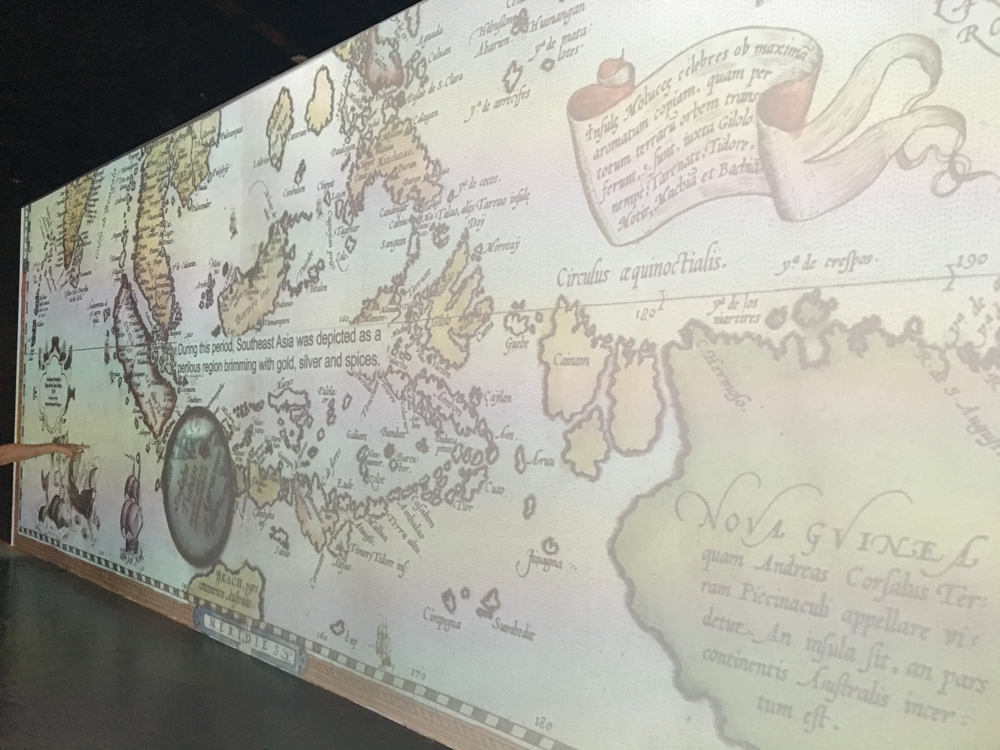

投影地图

 
应该讲述一下新加坡历史，不过除了创始人之外自己能记住的貌似也很少。Singapura是梵语“狮城”的谐音，所以新加坡有此别称，鱼尾狮也是新加坡的城市地标，在市中心滨海湾就有一座喷水的鱼尾狮雕塑。英属之前的就不说了，自英国东印度公司Thomas Stamford Raffles开始管辖这片地区，不久新加坡成为英国殖民地，这也是当地方向盘在车右侧的原因。博物馆后面那条路叫Stamford Road，最早看到错以为是Stanford，还想不知和斯坦福有什么联系，后来看到创始人Raffles的全名才明白，回去和室友说也才恍然大悟，之后去动物园的路上见到Thomas Road，便想Raffles真是让人无法遗忘。
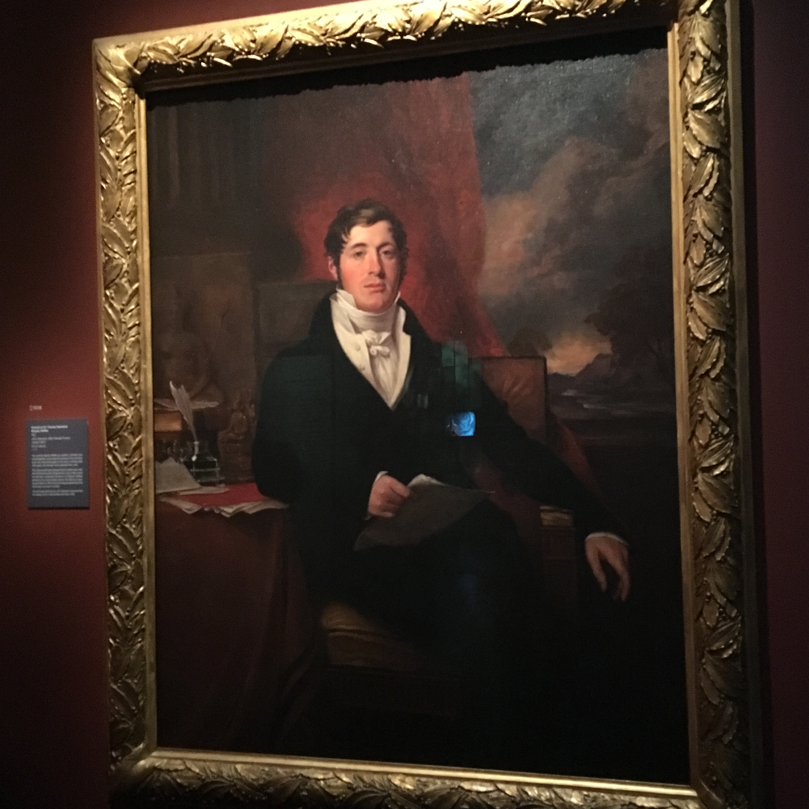

Thomas Stamford Raffles油画

 
随着港口贸易的不断繁荣，新加坡经济飞速发展，二战期间被日军占领直至三年后日本投降，英国恢复对新加坡的统治。但战后人民要求有更大的发言权，59年新加坡实行内部自治，李光耀出任首任总理。63年脱离英国统治加入马来西亚联邦，后由于政治等方面的冲突，65年脱离马来西亚正式独立成为共和国，现任第三位总理是首任总理李光耀的长子李显龙。
  
#### National Library Board, Singapore
吃完午饭刚好经过国家图书馆，就说顺便去看看，外面看上去很高现代化，坐落在繁华地段透明玻璃很容易让人以为是大公司，据说是目前东南亚规模最大、设施最先进的图书馆之一，受华裔富商李光前资助，所以到处可见Lee Kong Chian字样。本以为进去需要有证或者门票什么的，两个人在询问处和一个东南亚女性交流半天最后因为实在听不懂她的英语放弃，转向另一个交流无碍的工作人员，得知不需要任何证件就可以上去。楼下几层是剧院还是什么，7层以上是图书馆，藏书算得上丰富，看到很多关于中国传统文化的书籍，自习位置很多，坐满了带电脑学习的学生，和在学校的图书馆并无二致。感觉当地比较尊重文化，在市中心位置建一栋环境舒适的图书馆，进出不需要办手续之类（借书应当还是要的），藏书也比较经典。看到一本关于曾侯乙墓文物的图册，算得上有缘分了，还拍了照留念。每次看到图书馆整齐排列的书架都有一种愉悦的感觉，怪不得说天堂应该是图书馆的模样，想以后家里要有一整面墙的藏书，阅读是十分享受的事。
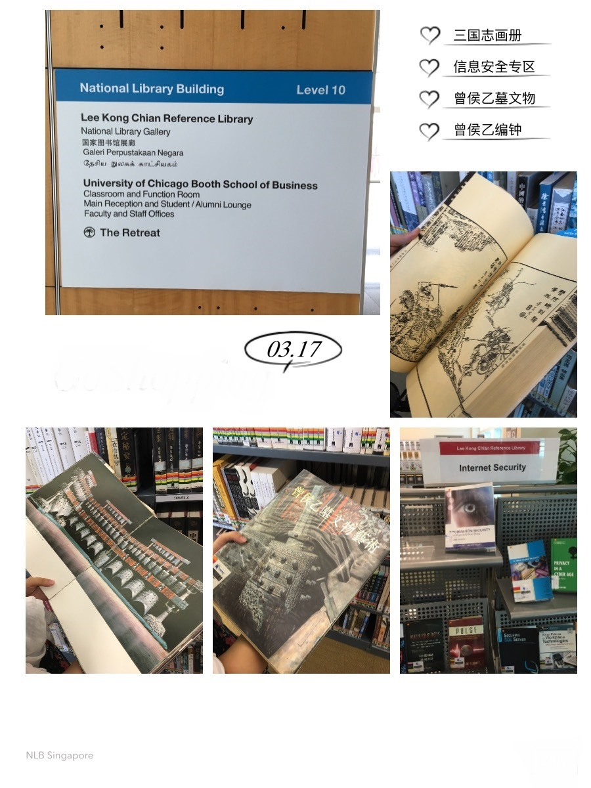

国家图书馆

 
#### National Gallery Singapore
新加坡国家美术馆由新加坡前高等法院和新加坡政府大厦改建而成，本不打算去的，总觉得自己没啥艺术细胞，逛过湖北美术馆没看出个所以然来，反正艺术么，懂不懂的说不清，表达的东西也就作者自己知道，不明觉厉就对了。

原政府大厦议事厅city hall chamber

 
前一天自己瞎逛时在外面看到一栋欧洲风格的高大建筑立刻就喜欢上了，纳闷是什么地方绕到正面一看是国家美术馆，想无论怎样都是要进去逛逛的。喜欢古希腊顺带对罗马也有好感，神庙的建筑风格让人很舒服，一如爱琴海端庄典雅。觉得美术馆外面的柱子有点像科林斯柱式结构，然而也并没有专业到能确定是不是，单纯喜欢它的大气，可惜时间太晚只好第二天再来。

罗马风格柱式city hall chamber

 
新加坡国家美术馆拥有新加坡乃至东南亚地区最大规模的19世纪至今的艺术收藏，逛过之后依旧保留对自己艺术欣赏水平的认知，不过整体的建筑风格与视觉效果让人觉得很值20新的票价，单纯建筑来看都算得上艺术品。一直偏爱内部空间阔旷高深站在地面得完全仰头才能看到顶的建筑，虽然在房间里但没有被束缚的感觉，就如看天地辽远深邃，感受得到自己的渺小。

美术馆内部结构

 
阳光正好，工作人员特别热情，只要和游客目光接触就会笑着说good afternoon，对于提问也是耐心解答，四楼有吴冠中的特别展，说来也巧，刚好有一个读库“我负丹青”笔记本。美术馆确实是个可以逛上一天的所在，在天台可以望见隔着一条街的滨海湾。
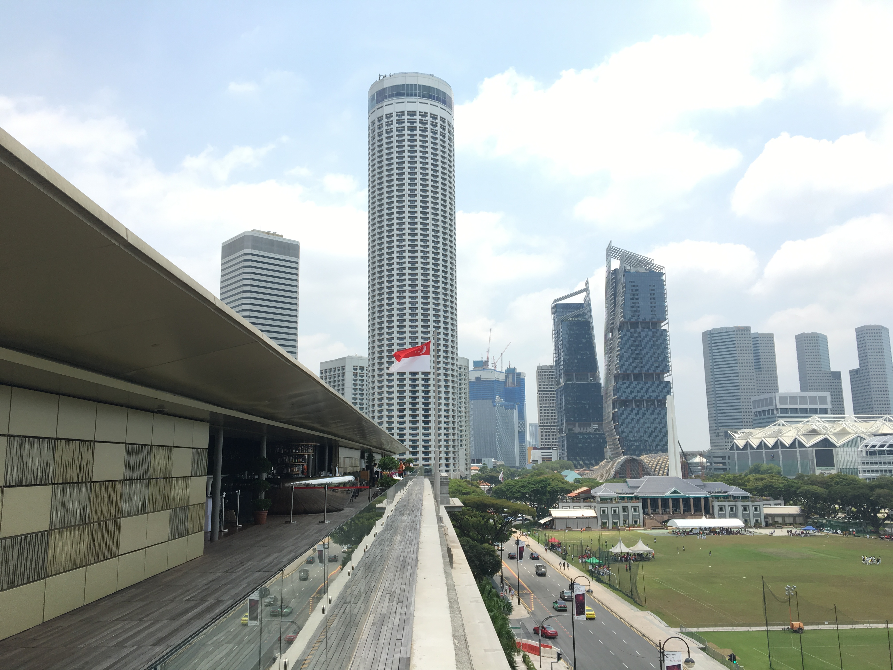

美术馆顶层花园

 
## 风景篇
#### Sentosa
位于南部的圣淘沙岛是备受推荐的旅游景点，算是一个大型的游乐园，有很多娱乐项目一天应该玩不够，像环球影城、海底世界和鱼尾狮塔都比较有名，我们差不多傍晚才到岛上，很多游人都在海边玩水。
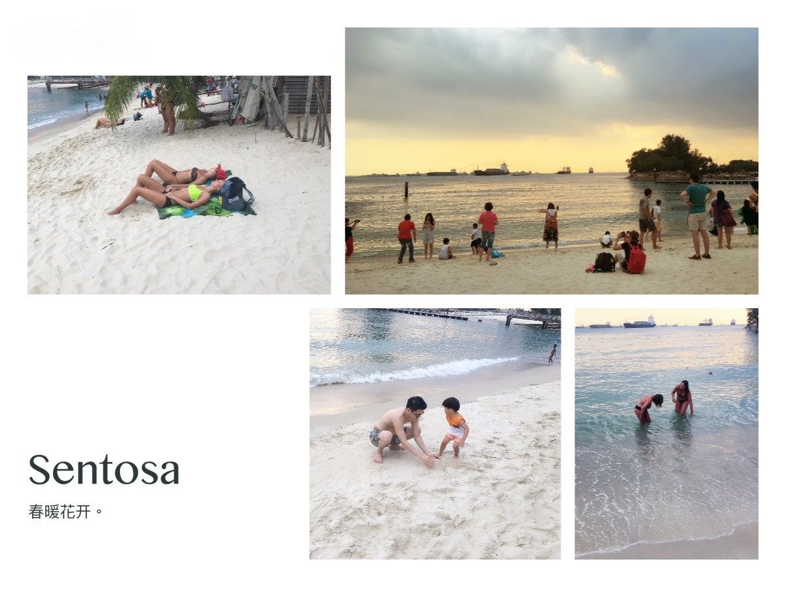

宽广的海面让人心境开阔

 
坐地铁在vivio city转express就可以到岛上，室友之前去过几次，不过据她说都没有这次看到的景色美。岛上广播是晚七点后禁止下海游泳，大概是怕出安全事故，不过七点之后也没有人查的样子，暮色四合，景色也安静下来。
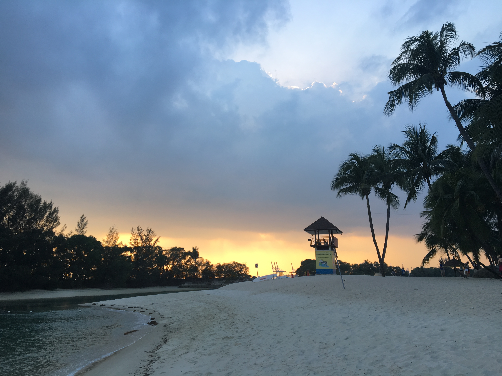

落霞满天

 
七点半左右日落，我们就在海边坐着各种拍照，等到太阳渐渐西沉便一个劲儿的拍海面余晖，后来安安静静坐着看落日镕金。虽然海面没有之前看过的海宽阔，海水也不见得多蓝，但总觉得那样的景色动人心神，是许久没有的宁静。
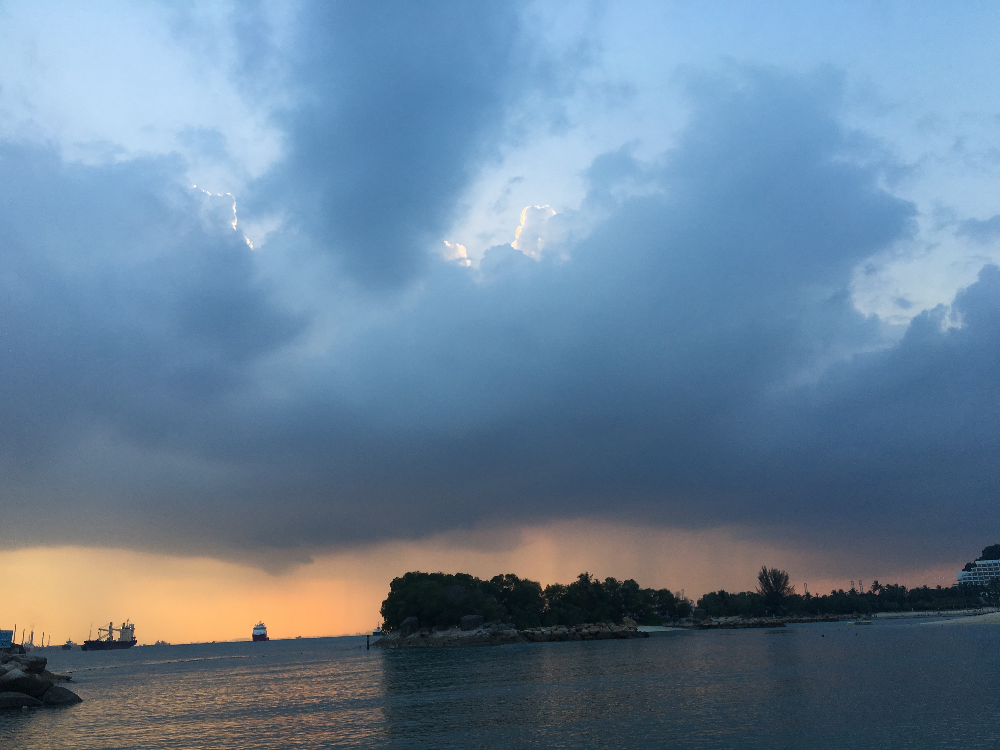

海面余晖（好吧并没有拍出余晖）

 
#### Singapore Flyer
早在去之前就想坐，据说165米42层楼的高度是世界最高的摩天观景轮，旋转一周大概要半个小时，刚好室友可以预约，从Sentosa回来便出发去摩天轮。

摩天轮位于滨海湾，不知是不是工作日的缘故，排队的人不是很多，每个座舱也就七八个人，内部空间很大，四周透明玻璃可以很好地观赏城市繁华夜景。摩天轮转动得很慢，从外面看基本都感受不到，所有人都拿相机手机在拍照，快到最高点时四方观望确实很美丽。矗立的建筑灯火通明，远望绵延无尽，河岸边五彩灯光变幻，连接两岸的立交桥上车辆川流，两个榴莲造型的滨海剧院令人印象深刻。恢宏巍峨的金沙酒店、三栋并列的金沙购物中心、林立的商业公司以及富丽堂皇的Fullerton Hotel可尽收眼底。
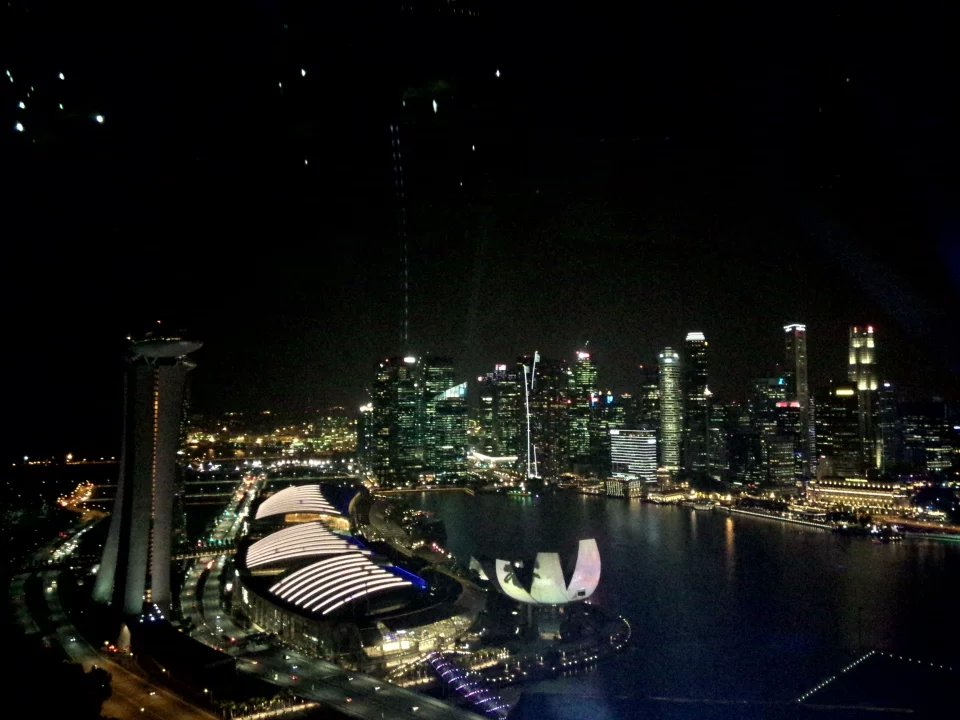

在摩天轮上俯瞰滨海湾

 
等快下去的时候和室友从窗边往回走，惊觉她的包就这么敞着口放在座位上，她若无其事拿起放着钱包手机的提包往外走，我说你这心未免也太大了，她说新加坡治安特别好，真是到了路不拾遗的地步。可能是因为犯罪刑罚很严重，鞭刑的威慑力还蛮大，每执行一下都需要检查犯人还能不能坚持下去再执行；而且当地的人都有自己的工作，看很多老人都会去便利店收银或者做些其它的自食其力，人们没必要偷盗或犯罪。所以当天晚上一点多我们还在她住处附近的一个公园里玩秋千，好吧自己还是有点担心，不过确实挺安全。
  
#### Singapore Zoo
动物园离市区有点远，公交过去一个多小时，很多人推荐这个和夜间动物园，两个离得很近一个截止到晚六点另一个晚七点开始，考虑到晚上拍照不能用闪光灯而且能看到什么动物也是碰运气，再加上晚上约了吃饭便只逛了动物园。

怎么说，没有预想中的那么精彩，可能之前期望值过高。斑马犀牛孔雀长颈鹿这些武汉动物园也有，整个占地面积可能和信息学部差不多，两个小时的时间应该是刚好。动物散养不过经过人工驯化，也就随便看看。想起上次去武汉动物园是大二还是大三，下次周末有空再去一趟。
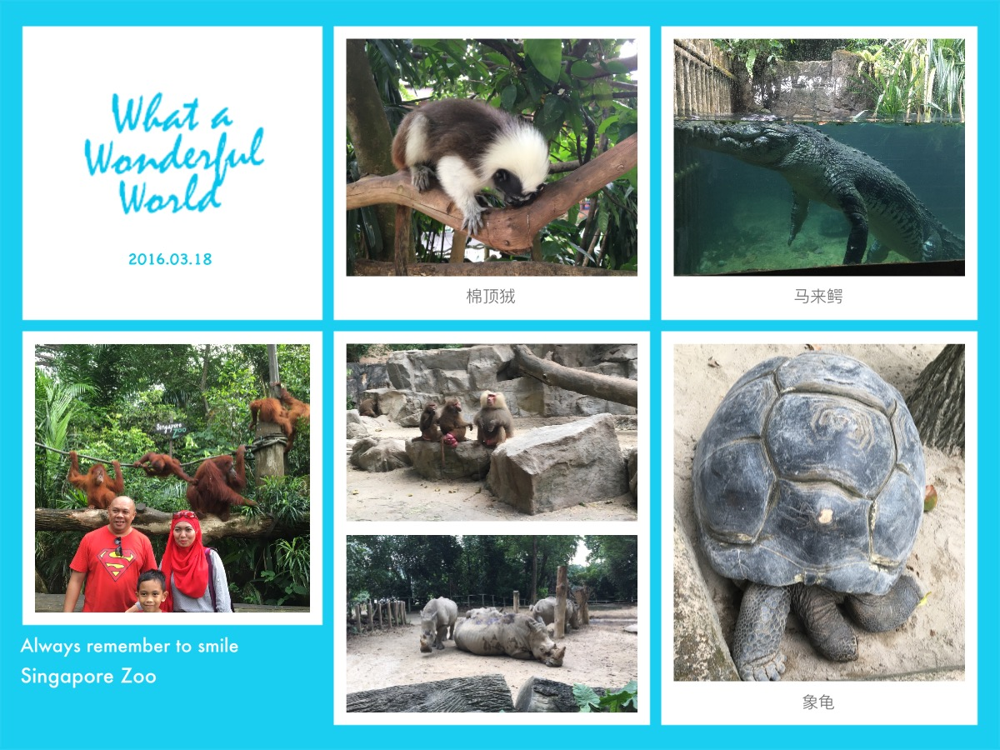

新加坡动物园

 
#### Marina Bay
不知为什么译成滨海湾，个人觉得是整个新加坡最繁华的中心地段，集赌场、剧院、酒店、会展中心于一身，在摩天轮上能看到全貌。美术馆国会大厦最高法院也离这边不过一条街，三天里每天都有往这边跑，白天夜里的繁华都看过，偏好夜景。

滨海湾金沙购物中心很有名，就在地铁bayfront站，里面空间很大，有一条运河穿过，可见坐船闲逛的游客。

运河穿过金沙购物中心

 
能看见有赌场casino的指示牌，到后很多人排队等着检查证件。初次去确实有点怵，不过外国游客只要检查一下护照就让进。里面好几层，排列着各种赌博项目，有像游戏机一样的单人机器，看起来赌注偏小。跟着逛了一圈，围观了几桌不过大部分的规则都不大能懂，感觉不是工薪阶层去的地方。随便参观没问题，里面的饮料免费，人声鼎沸整个大厅灯火通明，就是一个不分白天黑夜的地方，也不知多少人在这里倾家荡产抑或一夜暴富。其实特别激动一直想拍照，但又怕会像电影里被突然冒出的保镖截住，后来在二楼看对面一个人边走边小心翼翼在护栏边掩饰着拿手机拍照便也学样赶紧照了一张，还生怕离开的时候会被拦，不过最后还是平安无事，想也是这么大的地方，哪儿有人专门管这个。
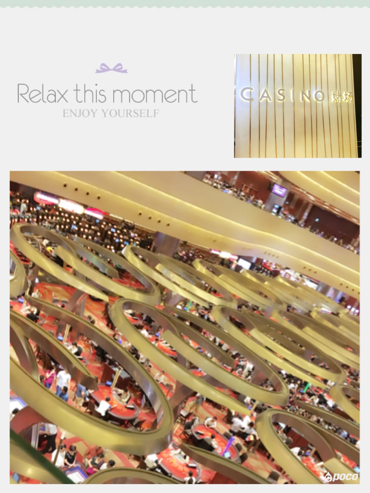

金沙赌场

 
走出购物中心差不多沿滨海湾边走了一整圈，比前一天晚上在摩天轮看到的更细致真切，晚上温度舒适，慢慢散着步是很惬意的事。金沙酒店（Marina Bay Sands Hotel）号称当今世上最昂贵的酒店，由三座连成一串的酒店大楼组成，顶部建有景色壮观的空中花园，之前提到的金沙购物中心也是它的一部分。
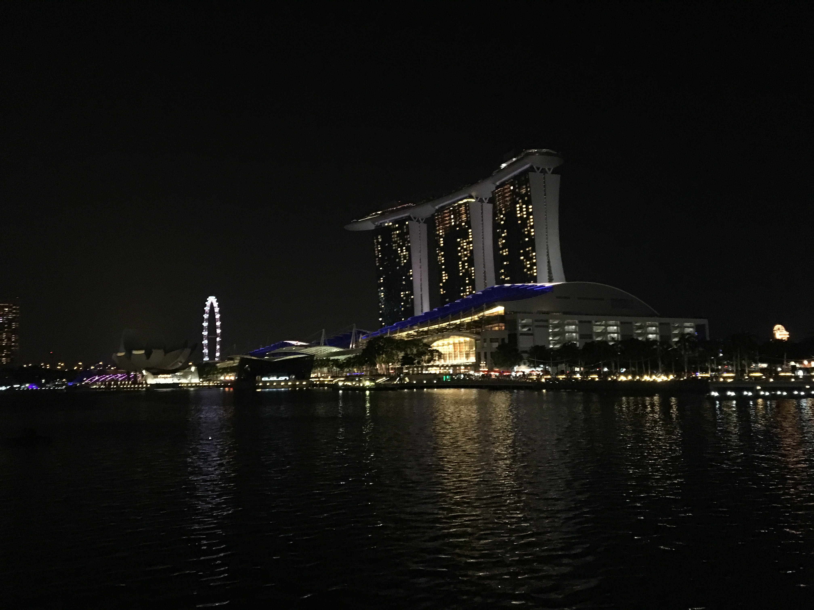

摩天轮与金沙酒店

 
Fullerton Hotel能在滨海湾中心地带与金沙酒店并立可见有其不凡之处（下图右侧不怎么高但灯火通明的是建筑）。始建于1919年，是新加坡一处重要的文化与建筑遗产，光从外观看气势一点也不输旁边林立的高楼，十分镇得住场面。

滨海湾夜景

 
第二天白天又走来这边，在外面看喷水鱼尾狮雕像、金沙酒店还有分列三栋的购物中心。
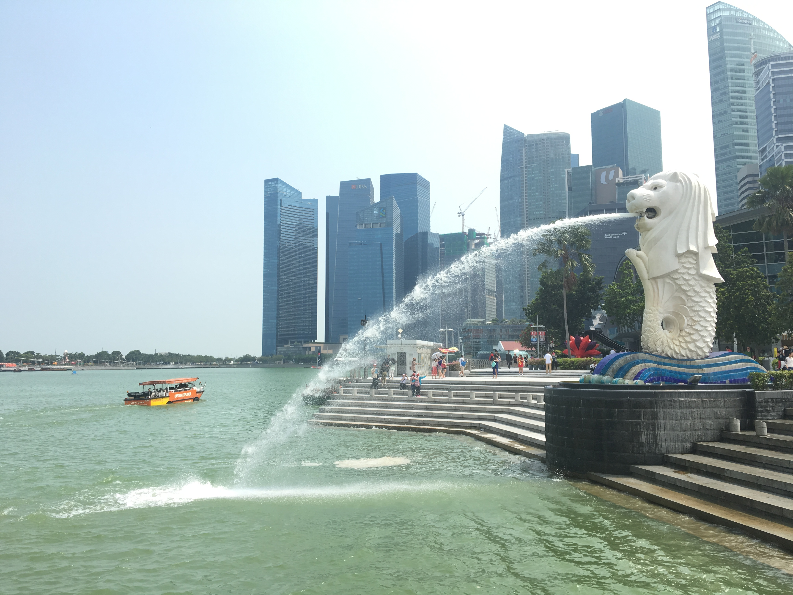

鱼尾狮雕像

 
听说一般来新加坡都是在这边合影所以也不能免俗拍了一张，实在是因为桥上望过去很舒服，小风吹走了下午的暑热，情不自禁。不过不大能欣赏金沙酒店的造型，外观并不美丽的样子。
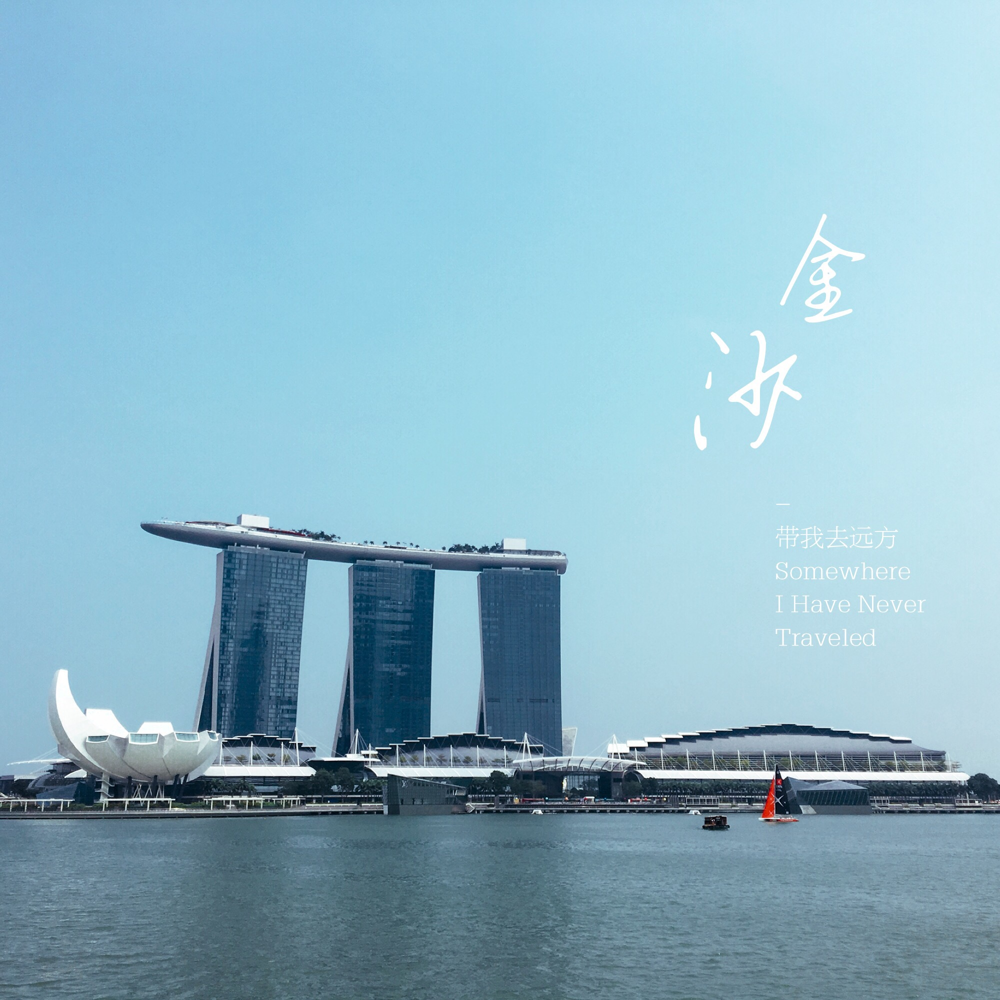

站在桥上远观金沙酒店

 
##饮食篇
#### Singapore Sling
去之前听说Singapore Sling是很有特色的鸡尾酒，那边超市有罐装的，不过卖酒有时间限制，早七点之前和晚十点多之后酒柜就锁了。头两天总在外面跑都没来得及喝，总是心心念念，室友说是带了点酒味的饮料，并不好喝，后来尝了下确实不怎么样，好歹是特色也算是体验。

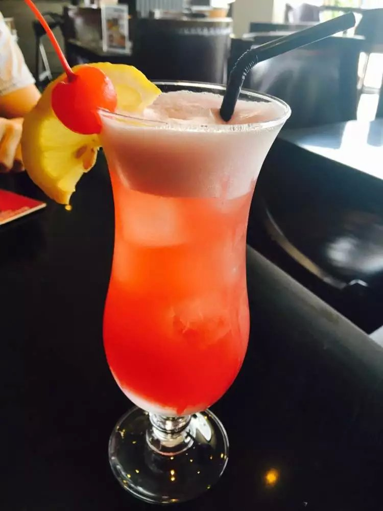

Singapore Sling

 

#### 猫山王榴莲
说到热带水果一定不能错过榴莲的，自己还蛮喜欢它的香味。在Chinatown地铁站一个出站口的集市有，看上去比较新鲜。马来西亚的猫山王是比较出名的品种，个头很小，没平常见的榴莲大，不过味道特别。老板人很好，开了最开始挑选的一个看没怎么熟还主动给换了一个，就坐在小店里慢慢吃起来，姜黄色，味道不涩，总之我这个味觉比较迟钝的人都觉得很不错。
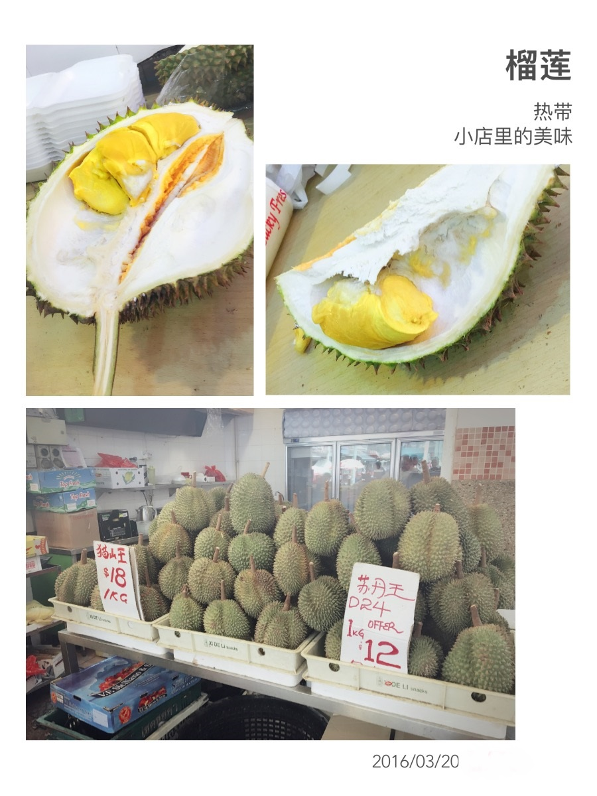

猫山王榴莲

 
#### 日式自助火锅
离开的前一晚在chinatown附近的唐城坊找了一家日料，外面看上去一般，里面有各种火锅定食，为了省事直接要的自助，豆乳锅底加上嫩嫩的青菜叶一看就让人有食欲，豆苗蘑菇还有乌冬面都好评，肉类吃的少，不过鱼块很嫩，用筷子戳一下会马上回弹的那种，以前都没发现扇贝这么好吃的说。饭间舍友说起很多来新加坡期间发生的事，还蛮感慨，觉得有人分享自己的生活是一件很快乐的事，所谓朋友存在的意义吧。希望以后一切都能顺顺利利。
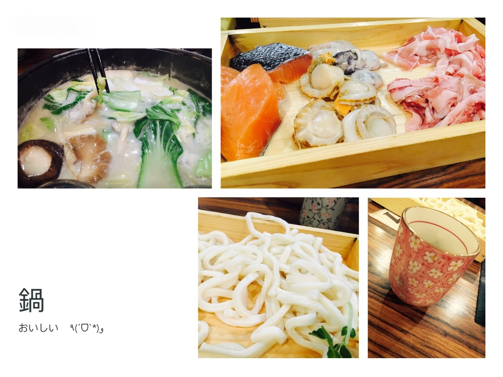

豆乳汤底火锅

 
#### Todai海鲜自助
在滨海湾金沙购物中心地下二层，是Todai在东南亚开设的首家餐厅，最吸引人的便是帝王蟹脚、生蚝和日式寿司，摆在门口的甜品也让人挪不动脚步，马卡龙、提拉米苏和抹茶慕斯色泽不要太诱人。整个店面积大环境很好，而且食物摆放也赏心悦目，进门可想拍照来着，但觉得旁边这么多人看着不大好意思，坐下吃了一会实在是忍不住，就厚着脸皮无视厨师走到特别好看的帝王蟹前照了一张，口水。本来是个对海鲜不怎么感冒的人，不过在老乡的推荐下尝了几只帝王蟹脚，味道真心是不错，加了柠檬汁的生蚝就不尝试了，寿司以及三文鱼刺身尝了些，马卡龙好评。小声说，其实是回来之后百度了店名才发现这个这个餐厅如此享誉胜名，对帝王蟹脚念念不忘。
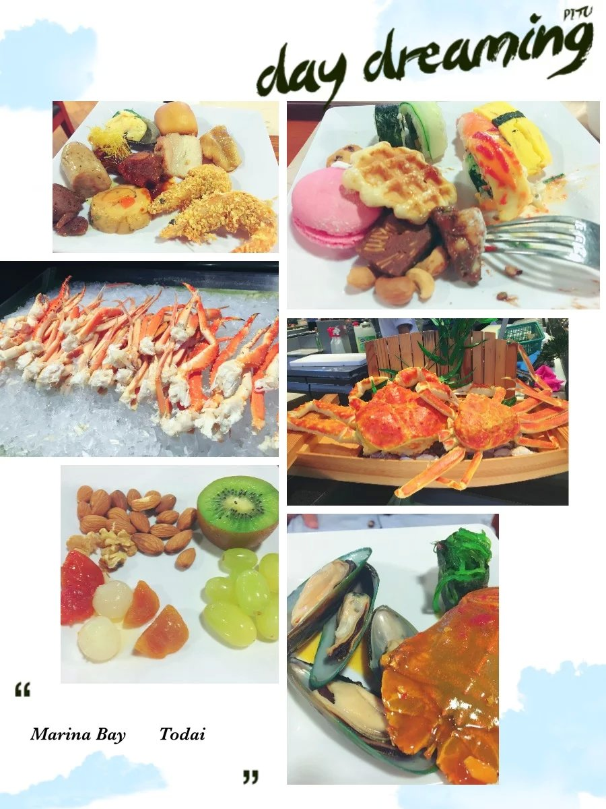

帝王蟹脚好评

 
其实也还有一些其它的，第一天早上吃的西式吐司和奶茶，小巧精致；最后一天早上如愿尝到了椰浆饭，也是室友不怎么推荐的一道，可惜为着一点执念好容易吃上，本以为是椰汁泡饭，尝过之后才发现就是平常的米饭，加上其它自选的配菜，应该是蒸饭时用的椰浆，而且椰香并不怎么浓郁，味道确实一般，不过算是没有遗憾了；还有第一天很晚才回到住处那边，去了舍友说她无意中在附近发现的小吃街（原谅我用这么接地气的名字），本来想着将就下随便吃点找了家印度饭店，菜名都不记得了，有饼、鱼、烤串、土豆块以及鸡肉卷各种，份量很足两个人没吃完最后打包了好些。一致认为是比较纯正的印度风味，咖喱味道特别，和平常吃到的不一样，羊肉串有种淡淡的甜味，小尝一口还吃不出羊膻，连平常不吃羊肉的我都吃了好几串，蘸料非常好看，颜色金红味道也让人回味。总之是意外惊艳的一餐，旁边桌有个气度不凡的印度老者端坐吃手抓饭，表示人家用手抓着食物往嘴里送的动作相当优雅，看来印度菜确实和本地人才是正确搭配。

 
##尾声
这次旅行算是相当愉快的，新加坡给我的总体印象就是环境优美经济发达治安好，名不虚传的花园城市，不过也是个阶级分化比较明显的地方，做体力活的一般是印度人，轻松一点的服务行业也有很多老人，它包容接纳着来自各个地方不同背景的人群，可以感受到不同国家的文化交流与冲击。

更重要的一点，有认识的人聊聊生活什么的相当开心，很感谢小伙伴的热情接待～
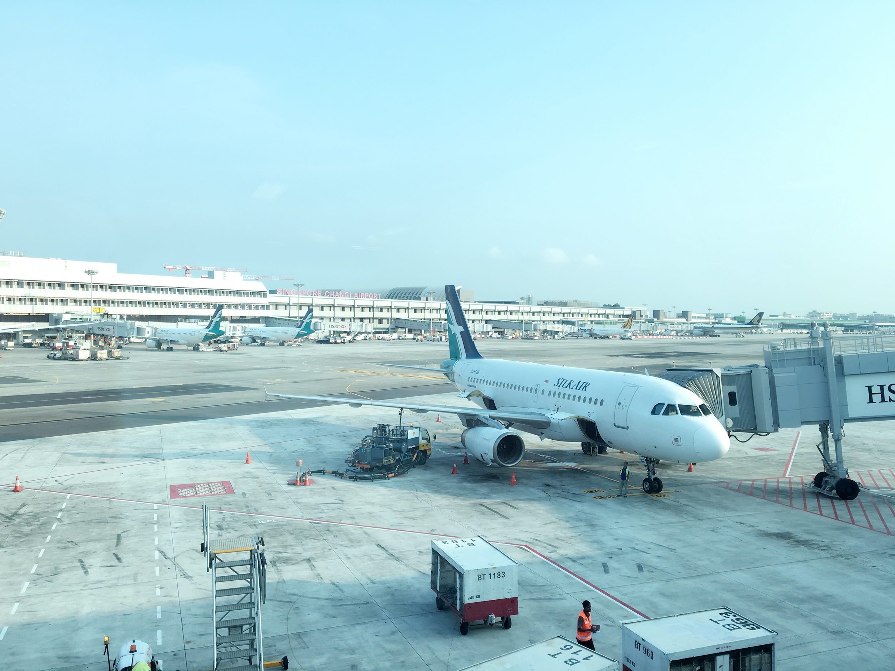

清晨。再见。

 
旅行的意义自己说不清，不管怎样，去另一个地方看看不同的风景，可以放松下心情也不错。从新加坡回来的第二天便又跟着老板去深圳出差，主要是另一个组结题验收，其实也没我们组什么事，去了之后简单交流了下项目进展。因为公司在郊区而深圳那一阵刚好接连大雨，从公司回来只能呆酒店里特别闷，因着天气原因又不能出去玩，于是交流完之后几个人商量赶紧买票回来。到学校是晚上，那天感受特别真切，真是看哪儿都顺眼。感慨在学校呆了这么多年还是有感情，当初刚来的时候也百般不习惯，现在和这个城市这个校园的牵绊应当很深了，觉得是第二个家。在外面跑了一周多才发现，原来所有对故乡对家的眷恋都有迹可循，外面的世界再美好都给不了自己归属感。人们总要找个可以寄托此身的所在，在外漂泊奋斗时可以支持自己走下去的精神支柱。

不知写这么长的口水文有没有人看，手机像素就这么高所以图片只能凑合看，过程中自己百度了N个词条才勉强保证没啥大错，总之对记性不好的人来说，算是记录了这个时期的经历与心情，经年后回过头来看能多回忆起一些往事就是了。

